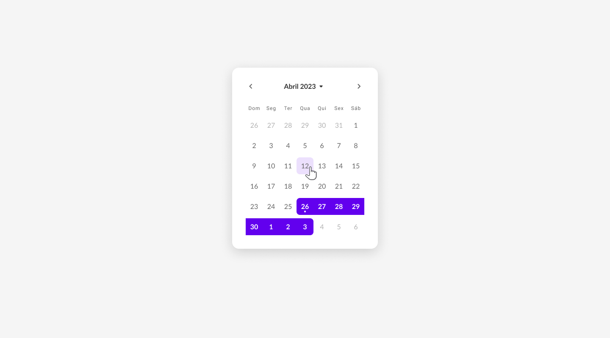

<h1 align="center">Diário de Bordo - Calendário com ReactJs</h1>

  #16 desafio <a href="https://boracodar.dev/">#BORACODAR</a> 

  <a href="#-Tecnologias Utilizadas">Tecnologias</a>&nbsp;&nbsp;&nbsp;|&nbsp;&nbsp;&nbsp;
  <a href="#-projeto">Projeto</a>&nbsp;&nbsp;&nbsp;|&nbsp;&nbsp;&nbsp;
  <a href="#-video">Video</a>&nbsp;&nbsp;&nbsp;|&nbsp;&nbsp;&nbsp;
  <a href="#-collaborators">Collaborators</a>&nbsp;&nbsp;&nbsp;|&nbsp;&nbsp;&nbsp;

 
 
 

Clique na imagem para assistir o video:

 
 
 

Bem-vindo ao meu diário de bordo! Este repositório contém o código fonte e arquivos relacionados ao diário de bordo em vídeo "Calendário" que você pode encontrar no meu canal do YouTube.

Neste vídeo, vou mostrar como criar uma Calendário com ReactJs do zero absoluto sem utilizar nenhuma biblioteca externa.

 

## 💠 Tecnologias Utilizadas

-   Vite
-   ReactJs
-   JavaScript
-   HTML
-   CSS
-   Git e Github
-   Figma

 

## 🔩 Funcionalidades

1. Navegar por mês
2. Navegar por ano
3. Selecionar data única
4. Selecionar data dupla
5. Visualização dinâmica de datas

 

## 👥 Contribuindo

Se você deseja contribuir com este projeto, sinta-se à vontade para abrir uma issue ou pull request. Será um prazer contar com a sua ajuda.

 

## Licença

Este projeto está sob a licença MIT. Consulte o arquivo LICENSE para obter mais informações.
